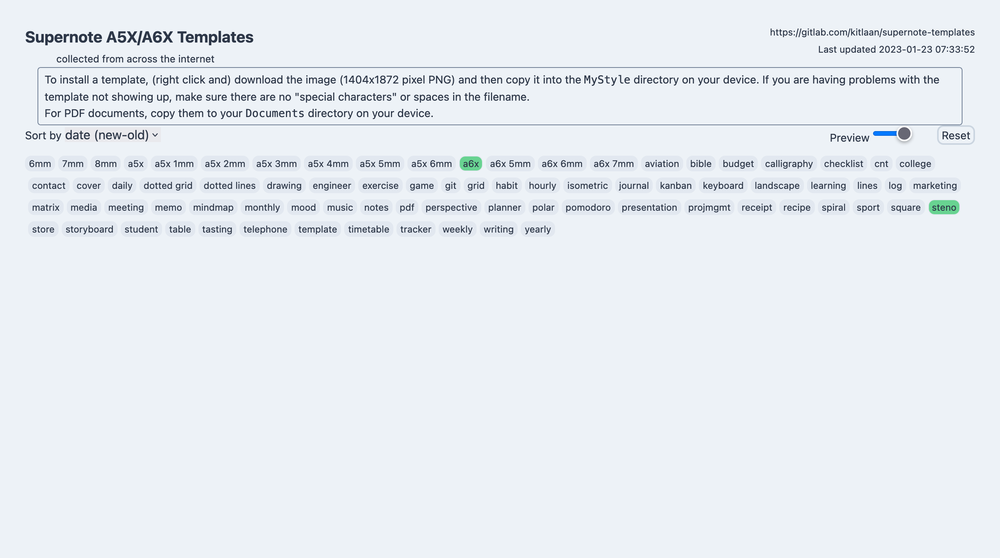
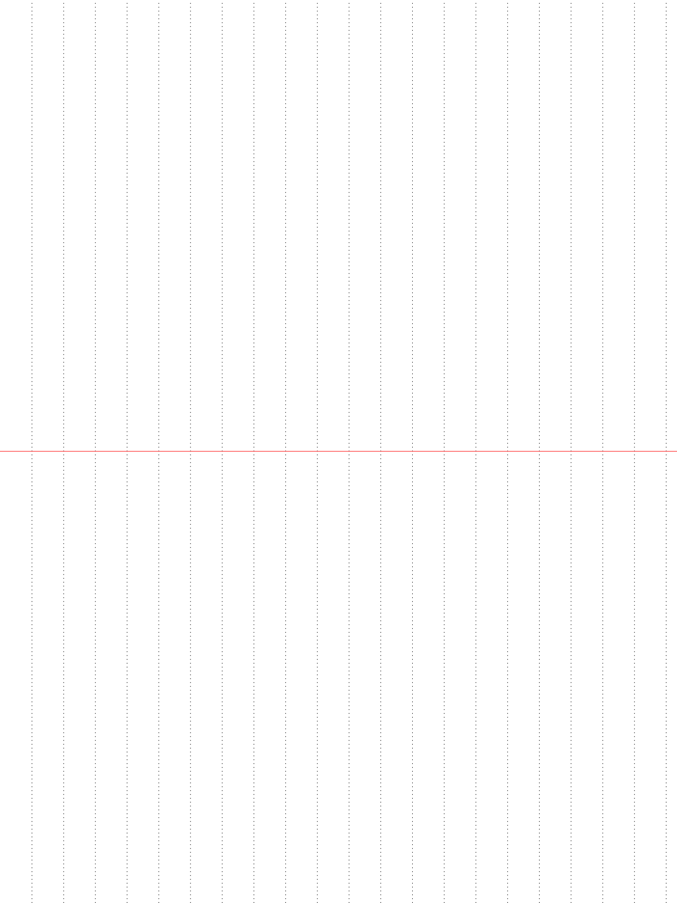

+++
categories = [ 'projects']
draft = false
published = '2023-03-14T16:51:46-05:00'
summary = """
A steno template for the Supernote A6 X.
"""
tags = ['graphic', 'Inkscape', 'Supernote A6 X', 'template']
title = "Steno Template"
+++

# Background
Inspired by Jim Kwik's [video](https://youtu.be/jBHLC8dff48) 
on how to effectively take notes it seemed that the steno layout would be most 
useful for capturing and creating notes.

# Problem

**No template exists.** 
To save paper and make my notes easier to search later I'd like to take notes on 
the Supernote A6 X E Ink tablet. Unfortunately, as of today no steno template 
exists for that device.

 
Source: https://supernote-templates.mostlyuseful.tech/

**Limited horizontal space.**
Pages in a steno pad are typically split into two columns of equal width. The 
Supernote A6 X is a E Ink tablet with a fixed orientation. This means there is 
702 pixels of horizontal space to capture notes. 

# Solution

While the orientation of the Supernote A6 X may be fixed, we don't have to use 
the device in that orientation. We propose creating a steno template and 
rotating it 90 degrees counterclockwise, so we can increase the horizontal 
space for capturing notes by ~33% from 702 pixels to 936 pixels. 
 
First, I used [Inkscape](https://inkscape.org/) to create a 1872 x 1404 SVG with 
a white background. Next I drew the lines using the Draw Freehand Lines tool. 
Finally, I exported the SVG as a PNG and used Preview to rotate the image 
90 degrees counterclockwise.

See this [support article](https://support.supernote.com/article/15/make-customized-note-template) 
for tips and tricks for creating your custom note template for the Supernote A5/A6 x devices.

You can download the steno template [here](steno.png). The SVG used to
create the PNG can be found [here](supernote_a6x_steno.svg).
